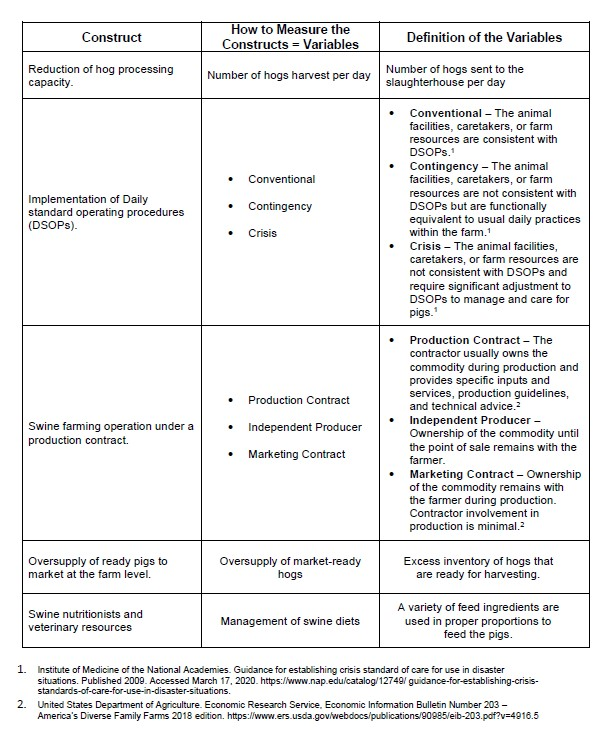
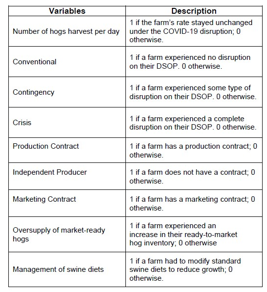
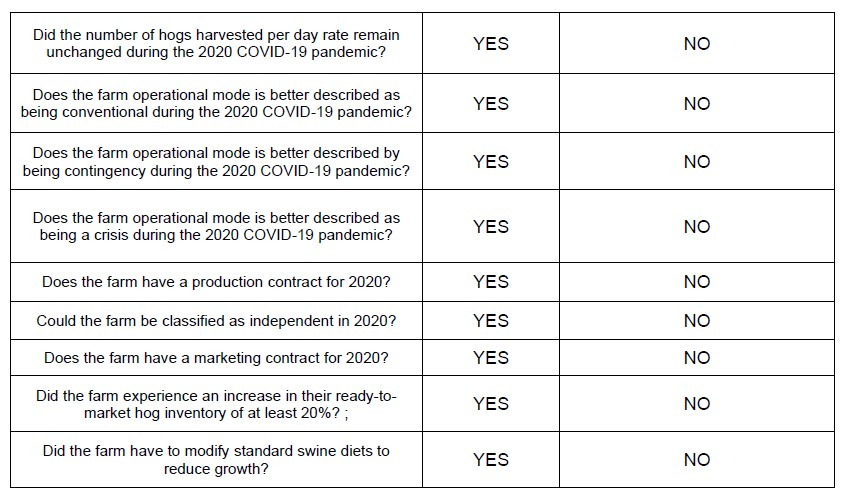

# A case study evaluation of the factors influencing the U.S. swine industry during COVID-19

The US pork integrated industry includes pig farmers, transportation companies, hog processing plants, distributors, and retailers.
The Hog processing plants around the country got affected during the early months of the Covid-19 Pandemic due to Covid-19 outbreaks inside the plants that led to a reduction in pig processing capacity of about 45% (Marchant-Forde and Boyle 2020).
The reduction of hog processing capacity at the plant level caused a backlog of ready pigs to market around the country swine’s farm sector.
The pig inventories sudden increase caused reduced hog prices and a disruption of normal livestock production.
This study focuses on the disruption of the swine producers by the Covid-19 Pandemic at the Hog Farming level due to the closure of Hog Processing Plants down the supply chain. The study investigates how contract farming, the farm’s marketing plan, the farm’s size, and the type helped to manage the risk associated with the closure of the Hog Processing Plants. To develop this study, we used the farm classification developed by USDA’s Economic Research Service (ERS) which classifies USA’s Farms (EIBN, 2018).

**Hypothesis (H1)**: The reduction of hog processing capacity negatively impacted the implementation of the swine farm’s daily standard operating procedures (SOPs).

**Hypothesis (H2)**: A swine farming operation under a production contract was positively associated with a better emergency plan to reestablish business continuity and daily standard operating procedures (SOPs) at the swine farm.

**Hypothesis (H3)**: A team of swine nutritionists and veterinary resources helped to manage the oversupply of ready pigs to market at the swine farming operation under a production contract.

This study uses data from swine farmers around the country. The data collection's main goal was to explore the factors that caused the disruption of the swine producers by the Covid-19 Pandemic at the Hog Farming level.

The questionnaire intends to collect the following information: (1) farm’s demographic data; (2) data on production, operation, and the number of hogs harvest per day, (3) monthly farm’s operational mode during 2020; (4) farm’s operational contract type; (5) data on each farmer’s knowledge on swine diet adjustment to reduce growth and farmer’s participation in the webinar by the swine’s industry to manage diets during the COVID-19 pandemic.

