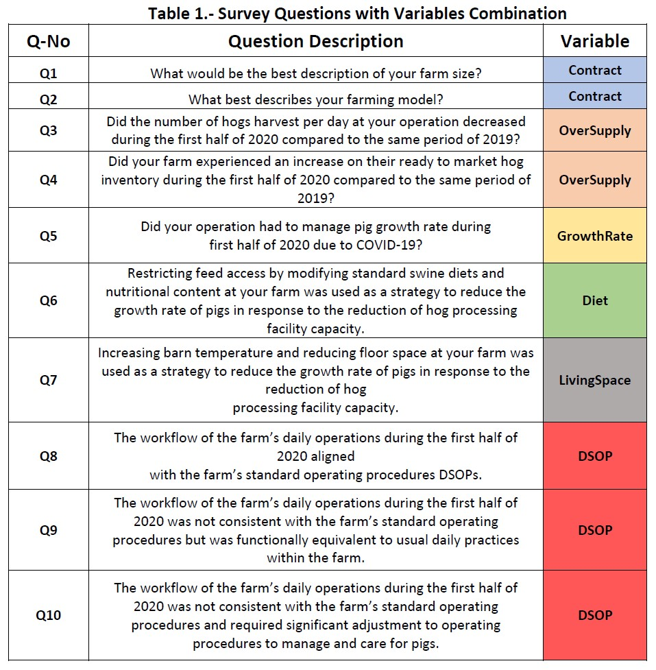
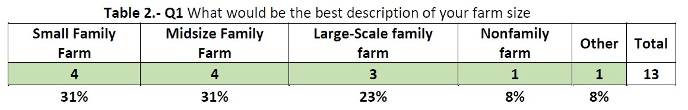
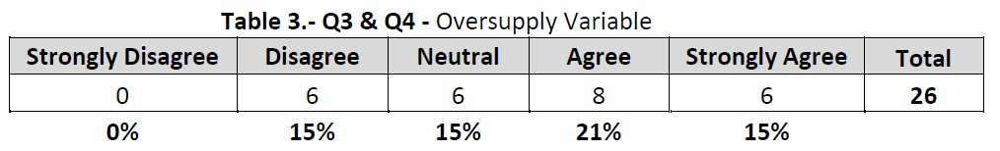
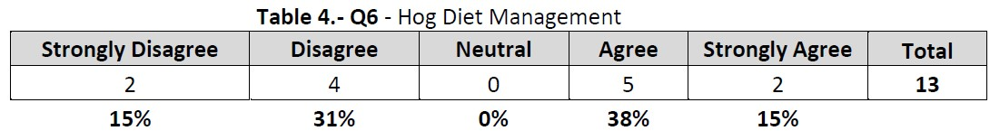

# A case study evaluation of the factors influencing the U.S. swine industry during COVID-19

The US pork integrated industry includes pig farmers, transportation companies, hog processing plants, distributors, and retailers.
The Hog processing plants around the country got affected during the early months of the Covid-19 Pandemic due to Covid-19 outbreaks inside the plants that led to a reduction in pig processing capacity of about 45% (Marchant-Forde and Boyle 2020).
The reduction of hog processing capacity at the plant level caused a backlog of ready pigs to market around the country swine’s farm sector.
The pig inventories sudden increase caused reduced hog prices and a disruption of normal livestock production.
This study focuses on the disruption of the swine producers by the Covid-19 Pandemic at the Hog Farming level due to the closure of Hog Processing Plants down the supply chain. The study investigates how contract farming, the farm’s marketing plan, the farm’s size, and the type helped to manage the risk associated with the closure of the Hog Processing Plants. To develop this study, we used the farm classification developed by USDA’s Economic Research Service (ERS) which classifies USA’s Farms (EIBN, 2018).

**Hypothesis (H1)**: The reduction of hog processing capacity negatively impacted the implementation of the swine farm’s daily standard operating procedures (SOPs).

**Hypothesis (H2)**: A swine farming operation under a production contract was positively associated with a better emergency plan to reestablish business continuity and daily standard operating procedures (SOPs) at the swine farm.

**Hypothesis (H3)**: A team of swine nutritionists and veterinary resources helped to manage the oversupply of ready pigs to market at the swine farming operation under a production contract.

This study uses data from swine farmers around the country. The data collection's main goal was to explore the factors that caused the disruption of the swine producers by the Covid-19 Pandemic at the Hog Farming level.

The questionnaire intends to collect the following information: (1) farm’s demographic data; (2) data on production, operation, and the number of hogs harvest per day, (3) monthly farm’s operational mode during 2020; (4) farm’s operational contract type; (5) data on each farmer’s knowledge on swine diet adjustment to reduce growth and farmer’s participation in the webinar by the swine’s industry to manage diets during the COVID-19 pandemic.

# Testing the Hypotheses

The case study used a [survey](https://www.surveymonkey.com/r/995CQV3) of 10 questions. The [survey](https://www.surveymonkey.com/r/995CQV3) was posted using the surveymonkey.com website platform. The [survey](https://www.surveymonkey.com/r/995CQV3) was sent to a total of 46 individual farms within the United States. In addition, the [survey](https://www.surveymonkey.com/r/995CQV3) was posted to 11 Facebook Groups with a total of 64,800 members as per Facebook-provided data. The [survey](https://www.surveymonkey.com/r/995CQV3) questions were collected between April and May 2021. The online [survey](https://www.surveymonkey.com/r/995CQV3) can be accessed [here](https://www.surveymonkey.com/r/995CQV3). The ten survey questions and variable combinations can be seen below, See Table 1.

Due to limited time and a lack of networking within the swine industry. The sample size is only 13 participants. However, the survey was able to help us to collect important information that compares to data available through the USDA’s Economic Research Service (ERS) which classifies USA’s Farms (EIBN, 2018).

As an example, the survey was able to identify that 62% of the people who answered the survey were from Small to Midsize Family farms, See Table 2. This quantity is mirroring the distribution of farms by the value of products shown on the USDA’s Economic Research Service (ERS) (EIBN, 2018).

According to our data analysis, we were able to accept all of the following hypotheses:

The Hypothesis (H1) was accepted as the p-value of 1.315e-05 is less than the 0.10 needed for a confidence interval of 90%. The code used to calculate Hypothesis (H1) values can be found here: [Mod_13_Part2_Analysis_Hypothesis_H1](Code/Mod_13_Part_2_Analysis_Hypothesis_H1.R) In addition, as you can see in Table 3, the Oversupply variable results show that farmers agree that a variation in the number of harvest hogs lead to an increase in the inventory level during the first half of 2020 compared to the same period of 2019, (Marchant & Boyle 2020).

As per Table 3, a total of 14 participants, or 36% of the participants agreed that disruption on the normal levels of hogs occurred during the first half of 2020.

The Hypothesis (H2) was accepted as the p-value of 2.169e-06 is less than the 0.10 needed for a confidence interval of 90%.

The Hypothesis (H3) was accepted as the p-value of 1.028e-05 is less than the 0.10 needed for a confidence interval of 90%. As you can see in Table 4 below, a higher percentage of participants agreed that the Hog diet played an important role in their inventory management during the early months of the COVID-19 pandemic, (Freese, 2020) & (Ep13-Pipestone, 2020).

# REFERENCES

•	Marchant-Forde JN, Boyle LA. COVID-19 Effects on Livestock Production: A One Welfare Issue. Front Vet Sci. 2020 Sep 30;7:585787. doi: 10.3389/fvets.2020.585787. Erratum in: Front Vet Sci. 2020 Nov 19;7:625372. PMID: 33195613; PMCID: PMC7554581. 

•	WHAT THE PORK INDUSTRY LEARNED FROM THE CORONAVIRUS DEBACLE - By Betsy Freese10/12/2020, Successful Farming, www.agriculture.com 
https://www.agriculture.com/livestock/pork-powerhouses/what-the-pork-industry-learned-from-the-coronavirus-debacle 

•	THESE 15 PLANTS SLAUGHTER 59% OF ALL HOGS IN THE US 
April, 9, 2020,  
http://jaysonlusk.com/blog/2020/4/9/these-15-plants-slaughter-59-of-all-hogs-in-the-us 
These 15 Plants Slaughter 59% of All Hogs in the US — Jayson Lusk 

•	US hog prices fall sharply in April as COVID-19 constrains slaughter capacity 
COVID-19: US hog prices drop as slaughter capacity is constrained - Swine news - pig333, pig to pork community 
https://www.pig333.com/latest_swine_news/covid-19-us-hog-prices-drop-as-slaughter-capacity-is-constrained_16155/ 

•	Episode 11: COVID-19 and it’s Impact on Pig Production with Dr. Beth Thompson 
Swine Time Podcast with Pipestone, By Pipestone, Jun 16, 2020 
https://www.pipestone.com/episode-11-covid-19-and-its-impact-on-pig-production-with-dr-beth-thompson/ 

•	Episode 13: We slowed pigs down: What was the effect and where do we go from here? 
Swine Time Podcast with Pipestone, By Pipestone, Jul 9, 2020 
https://www.pipestone.com/episode-13-we-slowed-pigs-down-what-was-the-effect-and-where-do-we-go-from-here/ 

•	Economic Information Bulletin Number (EIBN, 2018) 
America’s Diverse Family Farms: 2018 Edition (usda.gov) 

•	Marketing and Production Contracts Are Widely Used in U.S. Agriculture 
USDA ERS - Marketing and Production Contracts Are Widely Used in U.S. Agriculture 

•	Coronavirus: How the pandemic has changed the future of meat processing plants 
Coronavirus: How the pandemic has changed the future of meat processing plants - YouTube 

•	Slowing pig growth during COVID-19, models for use in future market fluctuations Mike D. Tokach, Bob D. Goodband, Joel M. DeRouchey, Jason C. Woodworth, and Jordan T. Gebhardt Department of Animal Sciences and Industry, Kansas State University, Manhattan, KS

•	Partnerships Were Key When COVID-19 Struck Pork Producers | News (iastate.edu)
https://www.extension.iastate.edu/news/partnerships-were-key-when-covid-19-struck-pork-producers The Iowa Pork Industry Center worked with industry partners to provide critical information to pork producers. September 24, 2020, 1:24 pm | Jason Ross, Chris Rademacher

•	COVID-19 Effects on Livestock Production: A One Welfare Issue. Jeremy N. Marchant-Forde and Laura A.Boyle. Published: 30 September 2020, doi: 10.3389/fvets.2020.585787

